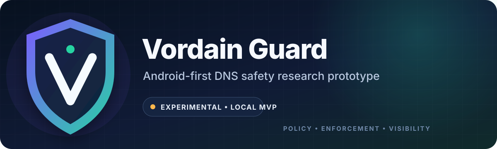

  

  
  
  
  
  

<strong>An Android-first family-safety prototype built around one promise: no silent bypass.</strong>

> [!WARNING]
> **Vordain Guard is unfinished, experimental, unaudited software—not a production parental-control product.** It does not provide complete protection and should not be installed with that expectation. The local development relay has no authentication or TLS and must never be exposed to the internet.

Vordain Guard explores a privacy-conscious parent/child architecture for local DNS policy enforcement, protection-state visibility, and bypass alerts on Android. The repository is published as a reference implementation for Android VPN, DNS filtering, policy-engine, and family-safety architecture work.

[Project status](#project-status) · [Architecture](#architecture) · [Quick start](#quick-start) · [Documentation](#documentation) · [Security](SECURITY.md) · [Contributing](CONTRIBUTING.md)

## Why this project exists

Most consumer controls can fail quietly: a VPN stops, a setting changes, or a device stops reporting while a parent still assumes protection is active. Vordain Guard's design goal is narrower and more honest:

> **Protected means confirmed. If protection stops or becomes unknown, surface that state.**

The project favors local enforcement, minimal data, explicit limitations, and clear protection states over claims of being unbypassable.

## Project status

| Area | Current state | Maturity |
| --- | --- | --- |
| Policy engine, DNS parser, classifier | Implemented with broad unit-test coverage | Functional foundation |
| Android VPN path | DNS-only local enforcement and protected upstream DNS | Experimental MVP |
| Parent and child apps | Programmatic beta/debug interfaces | Prototype |
| Parent/child sync | Copy/share bundles; in-memory relay reference | Manual/local |
| Remote test harness | Allowlisted debug-controller source; no-op release controllers | Reference only |
| Production backend and encrypted sync | Contracts and design boundaries only | Not implemented |
| Android Enterprise / MDM, billing, iOS | Roadmap concepts only | Not implemented |

See [Known Limitations](docs/KNOWN_LIMITATIONS.md) for the complete boundary. In particular, direct-IP traffic, some encrypted DNS paths, device tampering, other devices, and non-DNS traffic remain outside the current protection model.

## Architecture

~~~mermaid
flowchart LR
    Parent["Parent app policy + review"] -->|"Signed/debug bundle"| Child["Child app local state"]
    Child --> Engine["VPN + DNS engine local decisions"]
    Engine --> Events["Protection state events + alerts"]
    Events -->|"Local/debug sync"| Parent
~~~

The dependency rule is simple: the Android VPN service adapts the platform, the VPN engine orchestrates traffic decisions, and `core/policy` remains the source of truth for allow/block decisions.

~~~text
Policy → Enforcement → Event → Encrypted Alert (future)
~~~

Key design boundaries:

- enforcement and compatibility decisions stay on the child device;
- readable child browsing history is not intended for a Vordain backend;
- the policy engine is pure Kotlin and independent of Android UI and storage;
- every checked-in Android variant rejects cleartext traffic;
- active remote-test controllers exist only in Android `src/debug` source sets.

Read [Architecture](docs/ARCHITECTURE.md), [Threat Model](docs/THREAT_MODEL.md), and [Privacy Model](docs/PRIVACY_MODEL.md) for the detailed design.

## Included today

- Android parent and child application modules
- DNS normalization, parsing, classification, and policy evaluation
- DNS-only VPN service and runtime-state scaffolding
- policy presets, sync bundles, pairing, alerts, audit, and status models
- local Compatibility Mode contracts for approved apps
- local copy/share import and export flows
- an in-memory JVM development relay
- a visibly enabled, allowlisted debug test harness
- tests covering policy, DNS, VPN/session, relay, sync, status, and privacy boundaries

## Explicit non-goals

The current project does **not** include production cloud sync, full traffic forwarding, HTTPS decryption, AI monitoring, message scanning, screenshots, location tracking, subscription billing, iOS support, managed-device enrollment, or a guarantee against bypass.

This is disclosed family-safety research software, not covert monitoring software.

## Quick start

### Requirements

- JDK 17
- Android SDK 35
- Android device or emulator running API 26+
- Bash for the repository helper scripts

The Gradle wrapper downloads Gradle 8.10.2. Android Gradle Plugin 8.7.3 and Kotlin 2.0.21 are pinned in the build.

### Build and verify

~~~bash
git clone https://github.com/TenchiNeko/vordain-guard.git
cd vordain-guard
./tools/verify_beta_candidate.sh
~~~

For a quicker debug build:

~~~bash
./gradlew :apps:parent-app:assembleDebug :apps:child-app:assembleDebug
~~~

Generated APKs, signing material, local properties, and credentials are intentionally excluded from the repository.

## Local relay reference

The JVM relay defaults to `127.0.0.1:8081` and can be exercised from the development machine:

~~~bash
./tools/run_dev_relay.sh
~~~

All checked-in Android manifests reject cleartext traffic, and the apps ship with no relay URL configured. Consequently, the bundled apps do **not** connect to this HTTP relay out of the box. App-to-relay testing requires a contributor-supplied HTTPS endpoint or an uncommitted local configuration change.

> [!CAUTION]
> The relay accepts unauthenticated cleartext debug messages and allowlisted test commands. Keep it on loopback; do not forward its port or treat it as production sync. This repository intentionally ships no Android cleartext opt-in.

See [Remote Test Harness](docs/REMOTE_TEST_HARNESS.md) for commands and safety boundaries.

## Repository map

| Path | Purpose |
| --- | --- |
| `apps/parent-app` | Parent policy, status, review, and debug-sync interface |
| `apps/child-app` | Child setup, local protection state, and debug-sync interface |
| `core/*` | Platform-independent models, policy, events, crypto contracts, and sync |
| `vpn/*` | DNS parsing, classification, packet/session logic, engine, and Android service |
| `data/*` | Local storage and future relay/outbox abstractions |
| `backend/relay-api` | In-memory, local-only JVM debug relay |
| `features/*` | Feature-level domain and presentation logic |
| `tools/*` | Verification, APK export, relay, and lab-test helpers |
| `docs/*` | Architecture, privacy, threat model, test plans, and roadmap |

## Documentation

- [Architecture](docs/ARCHITECTURE.md)
- [Threat Model](docs/THREAT_MODEL.md)
- [Privacy Model](docs/PRIVACY_MODEL.md)
- [Known Limitations](docs/KNOWN_LIMITATIONS.md)
- [Product Vision](docs/PRODUCT_VISION.md)
- [Roadmap](docs/ROADMAP.md)
- [Tablet Testing Guide](docs/VORDAIN_TABLET_TESTING.md)
- [Remote Test Harness](docs/REMOTE_TEST_HARNESS.md)
- [Play Store Compliance Notes](docs/PLAY_STORE_COMPLIANCE.md)

## Contributing and security

Before contributing, read [CONTRIBUTING.md](CONTRIBUTING.md). Changes must preserve the project's privacy, dependency, and release-build safety boundaries.

For vulnerability reports and the project's support status, see [SECURITY.md](SECURITY.md). Do not include real child data, credentials, or sensitive family information in issues, logs, fixtures, or test reports.

## License

Copyright 2026 Vordain Labs LLC.

Licensed under the [Apache License 2.0](LICENSE). Third-party components retain their respective licenses; see [THIRD_PARTY_NOTICES.md](THIRD_PARTY_NOTICES.md).
